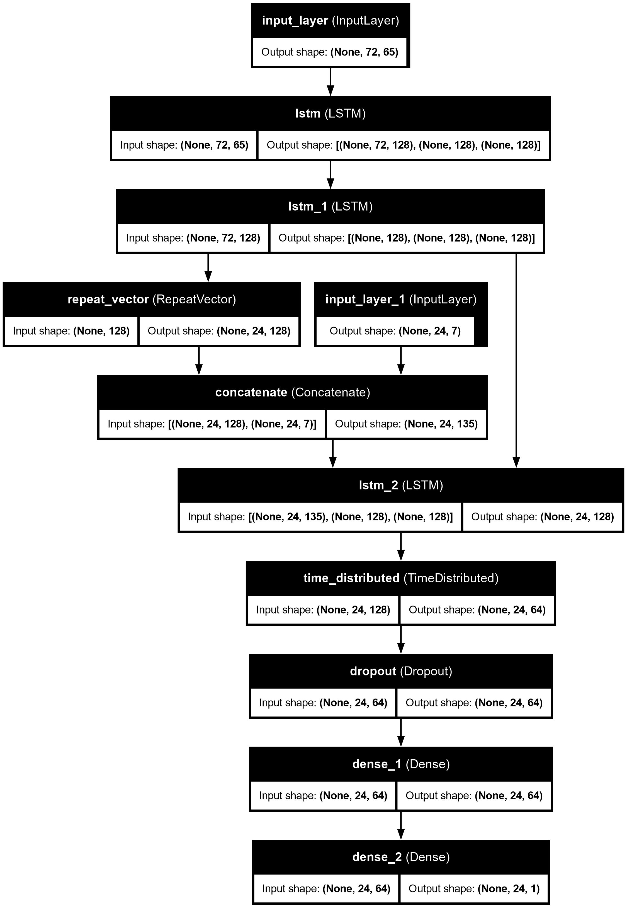
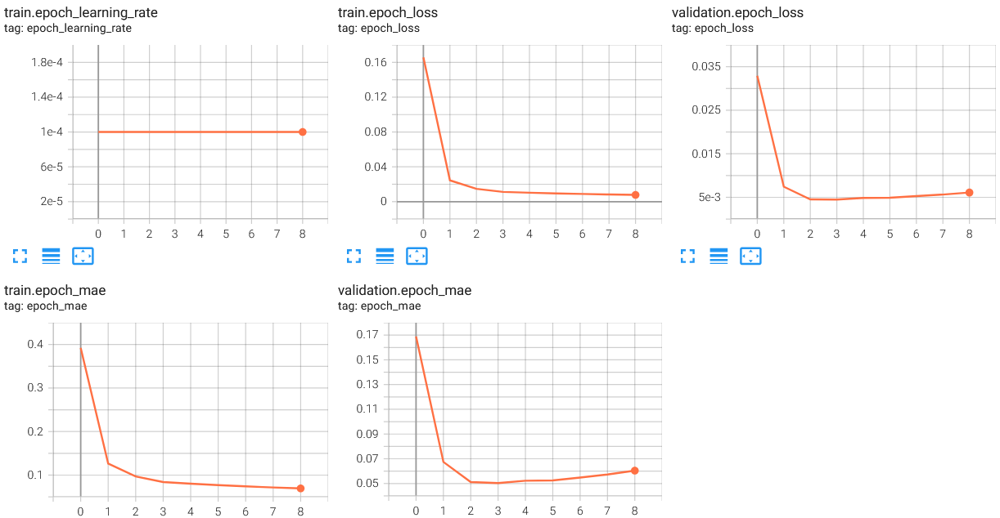
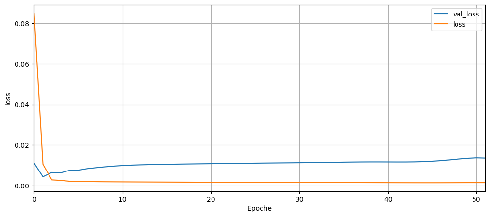
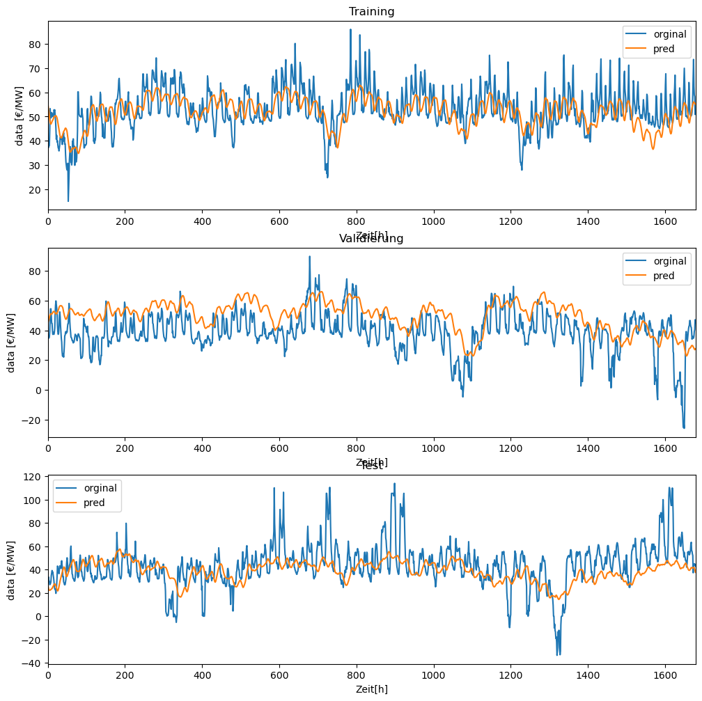

## 2.3 Kombiniertes Modell zu Ex Ante Prognose

### Modellhypothese
Die Grundlage für das Modell sollte das Ex-Post-Modell bilden. Es war jedoch aufgrund des Codes 
nicht möglich, das Modell entsprechend umzusetzen. Für die gezielte Ex-Ante-Prognose wurde stattdessen 
ein Encoder-Decoder-Modell gewählt. Im ersten Input befinden sich alle Daten, deren Informationen bis 
zum Zeitpunkt t−1t−1 bekannt sind. Der zweite Input 
umfasst die Prognosen, die bis zum Zeitraum t−1 vorliegen sollen.
Zunächst wurden zur Vorverarbeitung CNN-Layer vor den Encoder integriert. Dies 
führte jedoch zu einer Verschlechterung der Ergebnisse. Die Tiefe des Encoders wurde durch 
unterschiedliche Anzahlen von LSTM-Layern variiert. Dabei haben sich zwei LSTM-Layer als am besten 
erwiesen. Nach dem Decoder werden dessen Ausgaben in einem TimeDistributed-Dense-Layer verarbeitet. 
Dieser Layer stellt sicher, dass die Verarbeitung auf jede der Vorhersagen angewendet wird. Abschließend bildet ein Dense 
Layer den Output.

*Abb. 27: Modellarchitektur des Ex Ante Modells.*

### Hyperparameteroptimierung

Für das Modell werden folgende Hyperparameter optimiert.

*Abb. 28: Hyperparameteroptimierung des Ex Ante Modells.*

Aus der Optimierung ergeben entsprechend der Anzahl der Kombinationen viele Ergebnisse. Es wurde nach Ergebnissen mit einem
Validation_loss<0.08 gefiltert, um die Ergebnisse einzuschränken.

*Abb. 29: Kombinationen der Hyperparameter mit einem Loss<0.08.*

In den Loss-Funktionen unterscheiden sich die drei Modelle mit dem geringsten Validierungsfehlern nicht. Der Verlauf 
der Trainings-Funktion lässt auf ein Overfitting schließen. Als Maßnahme wurde die Lernrate um eine Zehnerpotenz reduziert.
Da keine weiteren Unterschiede zwischen den Varianten bestehen, wird folgende Hyperparametrisierung gewählt.

*Abb. 30: Gewählte Hyperparameter des Ex Ante Modells.*

Der Verlauf der Fehler ist folgender Abbildung zu entnehmen.

*Abb. 31: Verlauf der Fehler.*

### Ergebnisse des besten Modells

Mit den optimierten Hyperparametern liefert das Modell folgende Ergebnisse bei einem Training über 200 Epochen und einer patience von 50. Die batch_size ist 1680.

*Abb. 32: Verlauf der Fehler des besten Modells.*

*Abb. 33: Prognosen der Training, Validierung und Test-Daten.*

### Modellvalidierung und Bewertung

Da die Grundlage des Ex Post Modells den Erwartungen nicht entspricht, ist das Ergebnis des
Ex Ante Modells erwartet. 

Die Trainingsergebnisse reagieren im Vergleich zur Ex Post Analyse deutlich schwächer auf Preisschwankungen.
Sowohl Spitzen, als auch Täler sind breiter und dafür flacher ausgeprägt.Darüber hinaus scheint die Prognose 
leicht zeitlich nach hinten versetzt zu sein. Dennoch gibt das Training eine Richtung der Preisentwicklung an.

Ähnlich der Validierung des Ex Post Modells, überschätzt dieses Modell den Preis im Grundniveau. Der Verlauf 
ist auch in der Validierung deutlich weniger volatil. Auch die Validierung ist zeitlich versetzt.

Die Versetzung ist auch bei den Testprognosen gegeben. Die Beschreibung entspricht
Trainings- und Validierungsprognosen.
 
Im Folgenden werden mögliche Ursachen genannt.

**1. Features**

Da die Features denen des Ex Post Modells entsprechen, sind mögliche Ursachen der Qualität
identisch. 

**2. Modellarchitektur**

Aufgrund Schwierigkeiten bei der Umsetzung mehrerer Inputs in eine Encoder-Decoder-Architektur, 
ist die Architektur dieses Modells nicht komplex. Es wurden vor den Encoder CNN-Layer eingebaut. Dies hat 
jedoch in allen probierten Kombinationen (1 CNN, 2 CNN, mit und ohne Pooling) zu schlechteren Ergebnissen geführt.

**3. Hyperparameter**

Aufgrund der Modellarchitektur gab es nicht viele zu optimierende Hyperparameter. Darüber hinaus hat dieses Modell
in der Ausführung viel Zeit beansprucht, weshalb die Vielfalt der Optimierung eingeschränkt ist. Es 
ist leider nicht möglich gewesen per VPN auf den Server der FH-Aachen zuzugreifen. Die private Rechenleistung 
hat nicht mehr geleistet.

