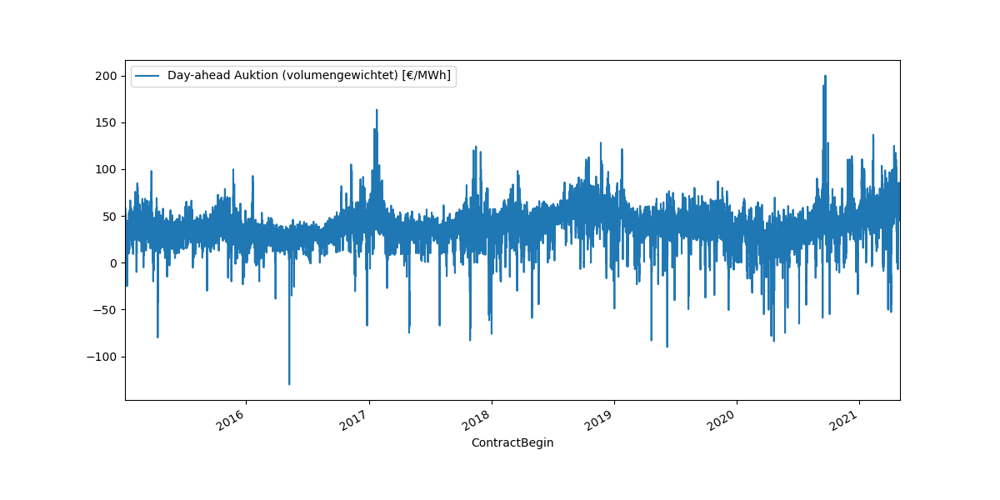
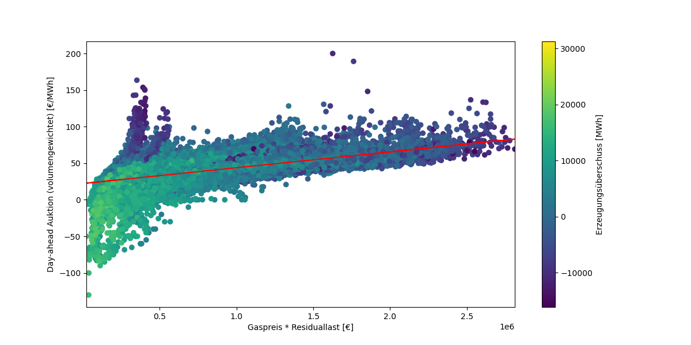
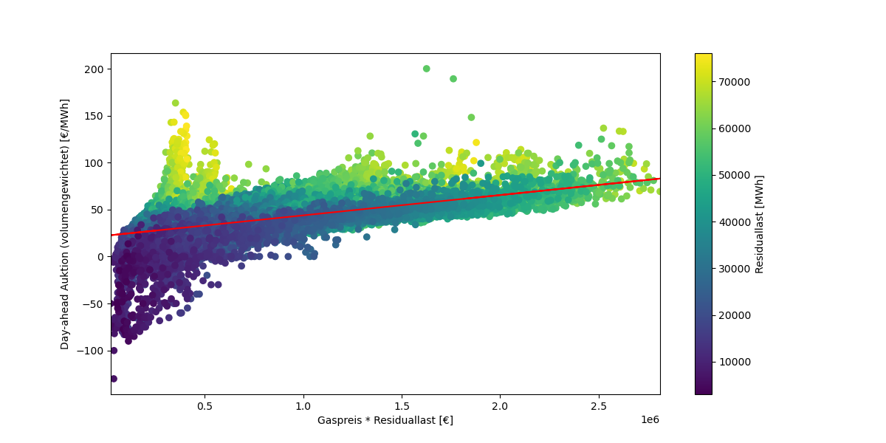

## 1. Deskriptive Analyse

### A. Einflussfaktoren auf den Day-Ahead-Preis

*Abb. 1: Einflussfaktoren auf den Day-ahead-Preis.*

*Quelle: Aufgabenstellung*

Die Bildung des Strompreises ist ein komplexes Verfahren. Wie die obere Abbildung zeigt, gibt es eine Vielzahl verschiedener Einflussfaktoren auf die Entwicklung des Strompreises. Einige Faktoren sind stark volatil, während andere relativ gut prognostizierbar sind. Andere Faktoren hingegen, wie das Wetter, können nie sicher vorausgesagt werden. Neben der Vielzahl der Einflussfaktoren machen Wechselwirkungen zwischen diesen die Prognose der Strompreisentwicklung zusätzlich komplex.

Grundsätzlich wird der Preis nach dem Marktprinzip aus Angebot und Nachfrage gebildet. Dazu werden Verbrauchsprognosen benötigt und erstellt. Die Erzeugung der Energie wird entsprechend der Merit-Order durch verschiedene Kraftwerkstypen gewährleistet. Dabei bestimmt das teuerste notwendige Kraftwerk den Preis.

Für diese Arbeit wurden folgende Daten ausgewählt:
- Stunde des Tages, Wochentag, Monat, Tag des Jahres, Feiertage
- Prognosen der Energieerzeugung (Wind Offshore, Wind Onshore, Photovoltaik, Sonstige Erneuerbare)
- Prognosen des Verbrauchs (Netzlast, Residuallast)
- Tatsächliche Erzeugung (Biosmasse, Wasserkraft, Wind Off- und Onshore, Photovoltaik, Sonstige Erneuerbare, Kernenergie, Braunkohle. Steinkohle, Erdgas, Pumpspeicher)
- Tatsächlicher Verbrauch (Netzlast, Residuallast, Pumpspeicher)
- Nettoexporte
- Ausgleichsenergie (Volumen + und -, Preis [€/MWh])
- Verbraucherpreisindex und BIP
- Brennstoffpreise (Kohle, Gas, CO2)

Durch die Auswahl der Daten ist der Großteil der Einflussfaktoren berücksichtigt. Die Wetter- und Klimaereignisse werden durch die Erneuerbaren Energien abgebildet.

### B. Recherche valider Quellen für die Daten

Die Daten sind folgenden Quellen entnommen:

- Day-Ahead-Strompreis [https://energy-charts.info/charts/price_average/chart.htm?l=de&c=DE&chartColumnSorting=default&interval=day&timeslider=0&year=2019&legendItems=ay1 (23.07.2024)]
- BIP & Verbraucherpreisindex [https://www.bundesbank.de/resource/blob/843330/0612f2c24e74a5b70a1bd159d5eea2ae/mL/0-lange-zeitreihen-data.pdf (22.07.2024)]
- Sonstige Daten [https://www.smard.de/home/downloadcenter/download-marktdaten/?downloadAttributes=%7B%22selectedCategory%22:5,%22selectedSubCategory%22:15,%22selectedRegion%22:false,%22selectedFileType%22:%22XLSX%22,%22from%22:1420066800000,%22to%22:1651269599999%7D (22.07.2024)]

Die Auswahl der Quellen ist als glaubwürdig einzustufen.

### C. Analyse der Daten und Feature Engineering

Im Folgenden werden die Datenreihen analysiert und Zusammenhänge herausgearbeitet. Auf dieser Grundlage wird die Auswahl der relevanten bzw. berücksichtigten Datenreihen getroffen. Die einzelnen Features werden miteinander verarbeitet. Nicht alle erstellten Features werden im weiteren Verlauf dokumentiert, da die vollständige Dokumentation den Umfang dieser Arbeit übersteigen würde und keinen zusätzlichen Nutzen für die Leserinnen und Leser bietet. Daher werden diese Features in diesem Text nur kurz thematisiert. Die Zusammenhänge sowie die Herleitung und Bedeutung der relevanten Features werden anschließend durch Abbildungen dargestellt.
Das BIP und der Verbraucherpreisindex bleiben im Verlauf der Arbeit unberücksichtigt. Die Commodity-Preise bilden den Marktzustand ausreichend ab. Darüber hinaus haben Testläufe gezeigt, dass diese Features einen negativen Einfluss auf die Prognose haben.

**Verlauf Day-ahead und Brennstoffpreise**

Auf den Abbildungen ist der Verlauf des Day-ahead-Preises, sowie der Brennstoffpreise zu sehen. Aufgrund der starken Veränderung ab der Mitte des Jahres 2021 werden in dieser Betrachtung Daten ab diesem Zeitpunkt unberücksichtigt gelassen. 

*Abb. 2: Verlauf des Day-ahead-Preises innerhalb des Betrachtungszeitraums.*

*Abb. 3: Verlauf der Brennstoffpreise innerhalb des Betrachtungszeitraums.*

**Periodizität**

Der Verlauf des Strompreises lässt mit dieser Skalierung keine Periodizität erkennen. Die Analyse der Daten nach Monat, Wochentag und Stunde zeigen diese jedoch deutlich. 
Ebenso wirken sich Feiertage auf den Strompreis aus. 

*Abb. 4: Einfluss der Tageszeit auf den Strompreis.*

Der Verlauf innerhalb des Tages zeigt eine Absenkung in der Nacht. Tags gibt es zwei Spitzen um je 7 und 18 Uhr.

*Abb. 5: Einfluss des Wochentags auf den Strompreis.*

Am Wochenende ist der Strompreis aufgrund sinkender Nachfrage der Industrie niedriger.

*Abb. 6: Einfluss des Monats auf den Strompreis.*

Im Mai und Juni erreicht der Strompreis seinen Tiefpunkt.

*Abb. 7: Einfluss der Feiertage auf den Strompreis.*

An Feiertagen ist der Strompreis wegen der fehlenden Nachfrage der Industrie niedriger.

**Brennstoffkosten**

*Abb. 8: Einfluss der Kosten für Braunkohle, Steinkohle und Gaskraftwerke auf den Strompreis.*

Es ist ein deutlicher Zusammenhang von zunehmenden Kosten (Brennstoff- und CO2-Kosten) und steigendem Strompreis in allen drei Abbildungen zu erkennen.

**Kohlekraftwerke**

*Abb. 9: Einfluss der Kohlekraftwerke auf den Strompreis.*

Die Kosten der Kohlekraftwerke haben einen entscheidenden Einfluss auf die Preisentwicklung. Diese ergeben sich aus dem Produkt des Preises für den Brennstoff und der Erzeugung.

**Erneuerbare Energien**

*Abb. 10: Einfluss der erneuerbaren Energien auf den Strompreis.*

Mit zunehmendem Verhältnis von Erneuerbaren Energien zu Residuallast sinkt der Strompreis. Je höher der Anteil der Erneuerbaren, desto geringer der Preis.

**Pumpspeicher**

*Abb. 11: Einfluss der Pumpspeicher auf den Strompreis.*

Mit zunehmender Einspeisung aus Pumpspeichern nimmt der Strompreis ab.

**Erzeugungsüberschuss**

*Abb. 12: Einfluss des Erzeugungsüberschusses auf den Strompreis.*

Bei Überschuss aus der Erzeugung nimmt der Preis ab. Bei zu mangelnder Erzeugung steigt der Preis an.

**Residuallast**

*Abb. 13: Einfluss des Residuallast auf den Strompreis.*

Mit steigender Residuallast, steigt auch der Strompreis.

**Zusammenfassung der deskriptiven Analyse**

Auf Grundlage der deskriptiven Analyser fällt die Wahl der Features wie folgt aus:

- Brennstoffpreise
- Zeitinformationen
- Anteil erneuerbarer Energien
- Erzeugungsüberschuss
- Pumpspeicher
- Residuallast

Das Engineering der Features im Code ist auf der nächsten Seite abgebildet. Dieser beinhaltet auch viele nicht genutzte Features.

