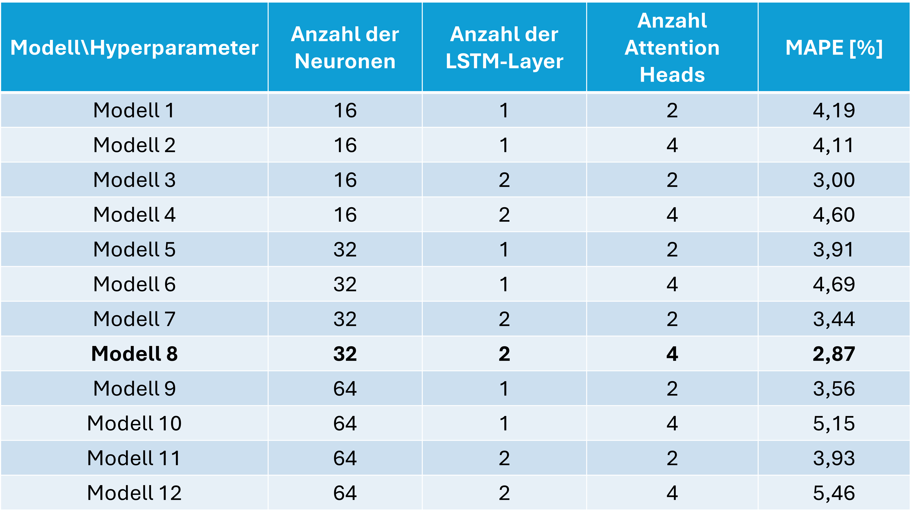
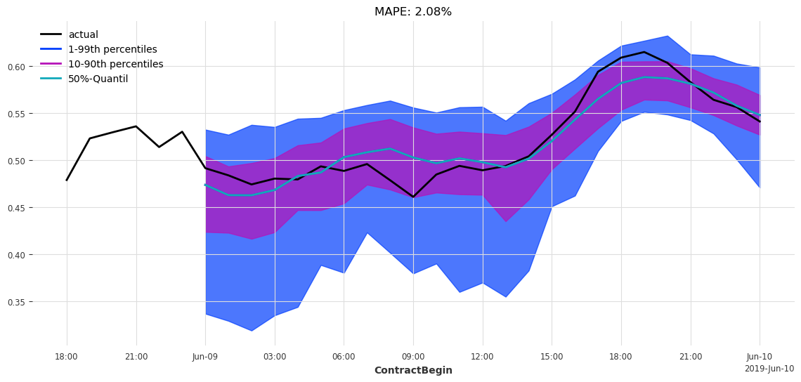
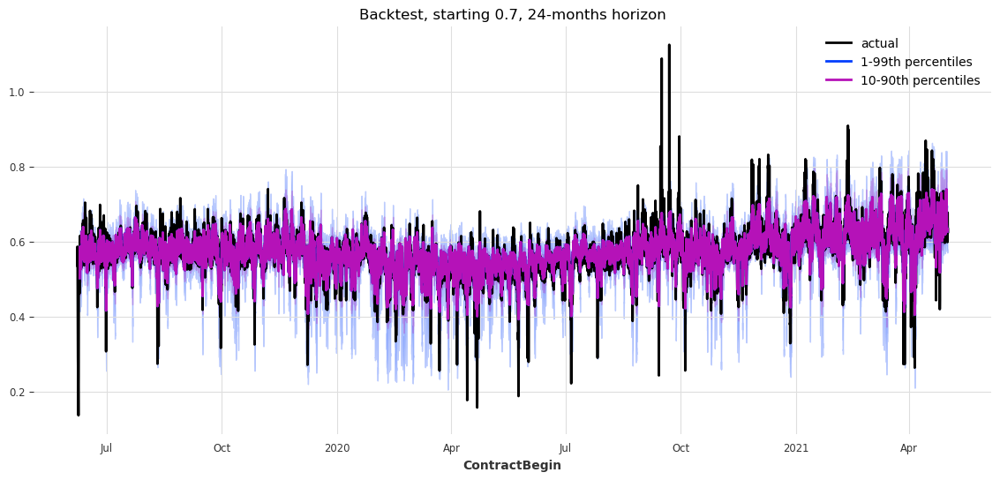

## 2.2 Temporal Fusion Transformer Modell zur Ex Post Analyse

### Modellhypothese
Die Auswahl der Features wurde zuvor ausführlich beschrieben. Für das TFT-Modell der Ex-Post-Prognose werden dieselben Features verwendet. Da dieses Modell die Prognose im Nachhinein durchführt, werden alle Features sowohl als "Past"- als auch als "Future"-Eingaben trainiert.

Die Architektur des Modells ist durch die Art definiert. In der Hyperparameteroptimierung wurden drei Parameter betrachtet:
1. Die Anzahl der Neuronen im Hidden Layer ('hidden_size')
2. Die Anzahl der LSTM Layer innerhalb des Encoder- und Decoder Teils ('lstm_layers')
3. Die Anzahl der Aufmerksamkeitsebenen ('num_attention_heads')

Folgende Parameter wurden aufgrund des geringeren Zeitaufwands einzeln ausgewertet:
1. 'dropout'
2. 'batch_size'

### Hyperparameteroptimierung

Aus der Hyperparameteroptimierung ergeben sich folgende Ergebnisse:

*Abb. 24: Hyperparameteroptimierung des Ex Post TFT Modells.*

Der niedrigste Mean Absolute Percentage Error (MAPE) liegt bei 2,87 %. Dabei sind die Anzahl der Neuronen der Hidden-Layer 32, die Anzahl der LST-Layer 2 und die Anzahl der Attention Heads 4. Mit dieser Parametrisierung wird das Modell einzeln über 40 Epochen trainiert. Das Ergebnis ist in der anschließenden Abbildung zu sehen.

### Ergebnisse des besten Modells

**Prognose 24h**

*Abb. 25: Prognose der nächsten 24h des Ex Post TFT Modells.*

**Backtesting**

*Abb. 26: Backtesting des Ex Post TFT Modells.*

### Modellvalidierung und Bewertung

Im Median der Prognosen zeigt sich bei starken Abweichungen eine träge Anpassung. Dennoch liefert das Modell eine zuverlässige Rekonstruktion des Preises. Der Preis befindet sich vollständig innerhalb des 1-99%-Quantils. Bis auf einen Ausbruch nach oben um 19 Uhr liegt der Preis innerhalb des 10-90%-Quantils.

Das Modell bietet einen allgemeinen Richtwert für die Preisentwicklung und liefert
 somit ein valides Ergebnis. Kurzfristige starke Änderungen werden jedoch nicht treffend abgebildet. 
Eine Verbesserung der Preisprognose ist durch eine Erweiterung oder Anpassung der Features möglich und notwendig. 
Ein Training über mehr Epochen könnte ebenfalls zur 
Verbesserung beitragen und bietet Potenzial für eine genauere Prognose.