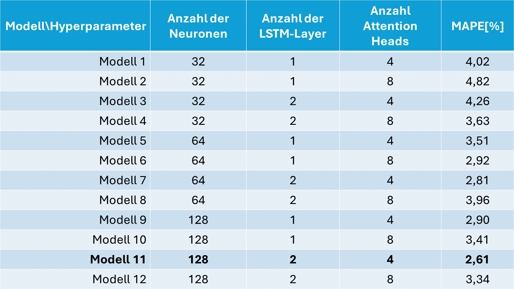
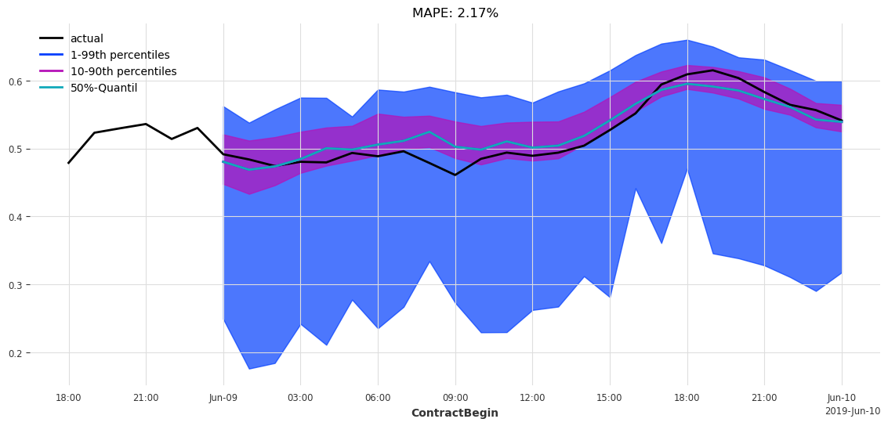
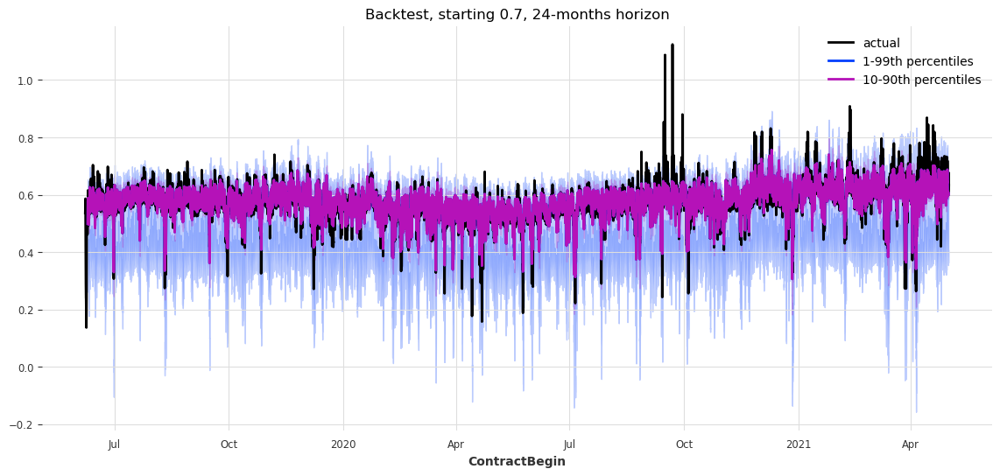

## 2.4 Temporal Fusion Transformer Modell zur Ex Ante Prognose

### Modellhypothese
Die Auswahl der Features wurde vorangehend ausführlich beschrieben. Für das TFT-Modell der Ex Ante Prognose werden dieselben Features verwendet. Die Features werden auf zwei Inputs aufgeteilt. Der erste Input beinhaltet alle Daten exklusive der Prognose. Diese werden dem Encoder übergeben. Dem Decoder werden die Outputs des Encoders sowie die Prognosedaten übergeben. 

Die Architektur des Modells ist durch die Art definiert. In der Hyperparameteroptimierung wurden drei Parameter betrachtet:
1. Die Anzahl der Neuronen des Hidden Layer ('hidden_size')
2. Die Anzahl der LSTM Layer innerhalb des Encoder und Decoder Teils ('lstm_layers')
3. Die Anzahl der Aufmerksamkeitsebenen ('num_attention_heads')

Folgende Parameter wurden aufgrund des geringeren Zeitaufwands einzeln ausgewertet:
1. 'dropout'
2. 'batch_size'

### Hyperparameteroptimierung
Aus der Hyperparameteroptimierung ergeben sich folgende Ergebnisse:

*Abb. 34: Hyperparameteroptimierung des Ex Ante TFT Modells.*

Der niedrigste Mean absolute percentage error liegt bei 2,61 %. Dabei sind die Anzahl der Neuronen der Hidden-Layer 128, die Anzahl der LST-Layer 2 und die Anzahl der Attention Heads 4. Mit dieser Parametrisierung wird das Modell einzeln über 40 Epochen trainiert. Das Ergebnis ist in der anschließenden Abbildung zu sehen.

### Ergebnisse des besten Modells

**Prognose 24h**

*Abb. 35: Prognose der nächsten 24h des Ex Ante TFT Modells.*

**Backtesting**

*Abb. 36: Backtesting des Ex Ante TFT Modells.*

### Modellvalidierung und Bewertung

Im Median der Prognosen verhält sich das Modell entsprechend der Ex Post Analyse mit dem TFT-Modell. 
Die Streuung der Prognosen ist gegenüber dem Ex Post Modell deutlich größer. Dennoch liefert das Modell
zuverlässige Richtwerte für die Entwicklung des Strompreises. In den Tiefpunkten überschätzt das Modell, sofern
der Abfall des Preises schnell passiert. Bei Hochpunkten verhält es sich entgegengesetzt.
Das Ergebnis des Modells ist valide. Ein Training über mehr Epochen ist angebracht und bietet Verbesserungspotenzial.